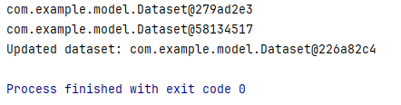
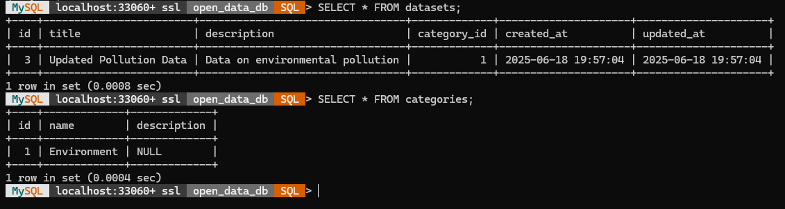

# Система управління відкритими даними

Цей документ містить інструкцію для створення системи управління відкритими даними за допомогою **MySQL** для зберігання даних та **Java** для реалізації CRUD-операцій через DAO.

---

## 1. Проєктування бази даних

### 1.1 Структура таблиць
Для реалізації системи зберігання відкритих даних я створив три таблиці:

1. **`datasets`** — таблиця для зберігання метаданих наборів даних.
2. **`categories`** — таблиця для зберігання категорій даних.
3. **`users`** — таблиця для обліку користувачів, які мають доступ до цих даних.

### 1.2 SQL-скрипт

**Файл:** `sql/create_open_data_db.sql`

```sql
CREATE DATABASE IF NOT EXISTS open_data_db;
USE open_data_db;

-- Таблиця категорій
CREATE TABLE IF NOT EXISTS categories (
  id INT AUTO_INCREMENT PRIMARY KEY,
  name VARCHAR(255) NOT NULL,
  description TEXT
);

-- Таблиця наборів даних
CREATE TABLE IF NOT EXISTS datasets (
  id INT AUTO_INCREMENT PRIMARY KEY,
  title VARCHAR(255) NOT NULL,
  description TEXT,
  category_id INT,
  created_at DATETIME DEFAULT CURRENT_TIMESTAMP,
  updated_at DATETIME DEFAULT CURRENT_TIMESTAMP ON UPDATE CURRENT_TIMESTAMP,
  FOREIGN KEY (category_id) REFERENCES categories(id)
);

-- Таблиця користувачів
CREATE TABLE IF NOT EXISTS users (
  id INT AUTO_INCREMENT PRIMARY KEY,
  username VARCHAR(100) NOT NULL UNIQUE,
  email VARCHAR(255) NOT NULL UNIQUE,
  password VARCHAR(255) NOT NULL
);
```

> **Пояснення:**  
> - У таблиці `categories` зберігаються категорії даних (наприклад, "Екологія", "Освіта" тощо).  
> - У таблиці `datasets` зберігається метаінформація про набори даних: заголовок, опис, категорія.  
> - У таблиці `users` зберігається інформація про користувачів системи, що мають доступ до даних.

---

## 2. Java-клас для підключення до бази даних

**Файл:** `src/com/example/util/DatabaseConnection.java`

```java
package com.example.util;

import java.sql.Connection;
import java.sql.DriverManager;
import java.sql.SQLException;

/**
 * Клас для отримання з’єднання з базою даних.
 */
public class DatabaseConnection {
    private static final String URL =
        "jdbc:mysql://localhost:3306/open_data_db"
      + "?allowPublicKeyRetrieval=true"
      + "&useSSL=false"
      + "&serverTimezone=UTC";
    private static final String USER = "root";
    private static final String PASS = "your_password_here";

    private static Connection connection;

    private DatabaseConnection() { }

    public static Connection getConnection() throws SQLException {
        if (connection == null || connection.isClosed()) {
            connection = DriverManager.getConnection(URL, USER, PASS);
        }
        return connection;
    }
}
```

> **Пояснення:**  
> - Параметри `allowPublicKeyRetrieval=true` та `useSSL=false` використовуються для розв’язання проблем із безпекою під час роботи з MySQL 8.  
> - `serverTimezone=UTC` налаштовує правильний час.

---

## 3. Моделі даних (POJO)

### 3.1 Dataset.java

**Файл:** `src/com/example/model/Dataset.java`

```java
package com.example.model;

import java.sql.Timestamp;

public class Dataset {
    private int id;
    private String title;
    private String description;
    private int categoryId;
    private Timestamp createdAt;
    private Timestamp updatedAt;

    public Dataset() { }

    public Dataset(String title, String description, int categoryId) {
        this.title = title;
        this.description = description;
        this.categoryId = categoryId;
    }

    // Геттери і сеттери
}
```

> **Пояснення:**  
> - Клас `Dataset` відображає таблицю `datasets` з полями `id`, `title`, `description`, `categoryId`, `createdAt`, `updatedAt`.

### 3.2 Category.java

**Файл:** `src/com/example/model/Category.java`

```java
package com.example.model;

public class Category {
    private int id;
    private String name;
    private String description;

    public Category() { }

    public Category(String name, String description) {
        this.name = name;
        this.description = description;
    }

    // Геттери і сеттери
}
```

> **Пояснення:**  
> - Клас `Category` відображає таблицю `categories` з полями `id`, `name`, `description`.

---

## 4. DAO-інтерфейси та їх реалізація

### 4.1 DatasetDAO.java

**Файл:** `src/com/example/dao/DatasetDAO.java`

```java
package com.example.dao;

import com.example.model.Dataset;
import java.sql.SQLException;
import java.util.List;

public interface DatasetDAO {
    void addDataset(Dataset dataset) throws SQLException;
    Dataset getDatasetById(int id) throws SQLException;
    List<Dataset> getAllDatasets() throws SQLException;
    void updateDataset(Dataset dataset) throws SQLException;
    void deleteDataset(int id) throws SQLException;
}
```

### 4.2 DatasetDAOImpl.java

**Файл:** `src/com/example/dao/DatasetDAOImpl.java`

```java
package com.example.dao;

import com.example.model.Dataset;
import com.example.util.DatabaseConnection;

import java.sql.*;
import java.util.ArrayList;
import java.util.List;

public class DatasetDAOImpl implements DatasetDAO {
    private final Connection conn;

    public DatasetDAOImpl() throws SQLException {
        this.conn = DatabaseConnection.getConnection();
    }

    @Override
    public void addDataset(Dataset dataset) throws SQLException {
        String sql = "INSERT INTO datasets (title, description, category_id) VALUES (?, ?, ?)";
        try (PreparedStatement ps = conn.prepareStatement(sql, Statement.RETURN_GENERATED_KEYS)) {
            ps.setString(1, dataset.getTitle());
            ps.setString(2, dataset.getDescription());
            ps.setInt(3, dataset.getCategoryId());
            ps.executeUpdate();
            try (ResultSet rs = ps.getGeneratedKeys()) {
                if (rs.next()) dataset.setId(rs.getInt(1));
            }
        }
    }

    @Override
    public Dataset getDatasetById(int id) throws SQLException {
        String sql = "SELECT * FROM datasets WHERE id = ?";
        try (PreparedStatement ps = conn.prepareStatement(sql)) {
            ps.setInt(1, id);
            try (ResultSet rs = ps.executeQuery()) {
                if (rs.next()) {
                    return new Dataset(
                        rs.getString("title"),
                        rs.getString("description"),
                        rs.getInt("category_id")
                    );
                }
            }
        }
        return null;
    }

    @Override
    public List<Dataset> getAllDatasets() throws SQLException {
        List<Dataset> datasets = new ArrayList<>();
        String sql = "SELECT * FROM datasets";
        try (Statement st = conn.createStatement();
             ResultSet rs = st.executeQuery(sql)) {
            while (rs.next()) {
                datasets.add(new Dataset(
                    rs.getString("title"),
                    rs.getString("description"),
                    rs.getInt("category_id")
                ));
            }
        }
        return datasets;
    }

    @Override
    public void updateDataset(Dataset dataset) throws SQLException {
        String sql = "UPDATE datasets SET title=?, description=?, category_id=? WHERE id=?";
        try (PreparedStatement ps = conn.prepareStatement(sql)) {
            ps.setString(1, dataset.getTitle());
            ps.setString(2, dataset.getDescription());
            ps.setInt(3, dataset.getCategoryId());
            ps.setInt(4, dataset.getId());
            ps.executeUpdate();
        }
    }

    @Override
    public void deleteDataset(int id) throws SQLException {
        String sql = "DELETE FROM datasets WHERE id = ?";
        try (PreparedStatement ps = conn.prepareStatement(sql)) {
            ps.setInt(1, id);
            ps.executeUpdate();
        }
    }
}
```

> **Пояснення:**  
> - Реалізація CRUD-методів для роботи з таблицею `datasets` за допомогою SQL.

---

## 5. Головний клас: Main.java

**Файл:** `src/com/example/Main.java`

```java
package com.example;

import com.example.dao.*;
import com.example.model.*;

import java.sql.SQLException;
import java.util.List;

public class Main {
    public static void main(String[] args) {
        try {
            DatasetDAO datasetDAO = new DatasetDAOImpl();

            // 1) Створення набору даних
            Dataset dataset = new Dataset("Pollution Data", "Data on environmental pollution", 1);
            datasetDAO.addDataset(dataset);

            // 2) Виведення усіх наборів даних
            List<Dataset> allDatasets = datasetDAO.getAllDatasets();
            allDatasets.forEach(System.out::println);

            // 3) Оновлення
            dataset.setTitle("Updated Pollution Data");
            datasetDAO.updateDataset(dataset);
            System.out.println("Updated dataset: " + datasetDAO.getDatasetById(dataset.getId()));

            // 4) Видалення
            datasetDAO.deleteDataset(dataset.getId());
            System.out.println("Dataset deleted");

        } catch (SQLException e) {
            e.printStackTrace();
        }
    }
}
```

---

## 6. Як налаштувати та запустити проєкт

1. **Запуск MySQL:**
   - Виконайте SQL-скрипт:
     ```sql
     SOURCE path_to_sql/create_open_data_db.sql;
     ```

2. **Налаштування:**
   - Додайте JAR-файл для `mysql-connector-java` у classpath проєкту.
   - Замініть пароль у `DatabaseConnection.java`.

3. **Запуск:**
   - Скомпілюйте Java-клас:
     ```bash
     javac -d out src/com/example/util/DatabaseConnection.java                   src/com/example/model/*.java                   src/com/example/dao/*.java                   src/com/example/Main.java
     ```
   - Запустіть:
     ```bash
     java -cp out:mysql-connector-java.jar com.example.Main
     ```

---

## 7. Результати

1. Запуск з консолі виводитиме додавання, оновлення, видалення наборів даних.
2. У MySQL можна перевірити зміни за допомогою SQL-запитів:
   ```sql
   SELECT * FROM datasets;
   SELECT * FROM categories;
   ```
## Скріншоти роботи

Додавання тестового користувача

Результат додавання у таблиці


---


